# 🌟 Agency Reviews – Connect Businesses with Verified Marketing Agencies

Agency Reviews is a full-stack platform designed to help businesses discover, review, and connect with **verified marketing agencies**. With advanced filtering, agency verification, and user-generated reviews, clients can confidently find the right agency for their needs.

---

## 🚀 Features

- ✅ Submit & manage agency reviews
- 🧾 Verified agency onboarding system
- 🔎 Smart filters by services, ratings, location
- 💬 User-friendly review & feedback flow
- ⚡ Fast, secure, responsive performance

---

## 🛠 Tech Stack

| Frontend     | Backend    | Styling       | API            |
|--------------|------------|----------------|----------------|
| React.js     | Node.js    | Tailwind CSS   | GraphQL        |

---

## 📸 Screenshots

<p float="left">
  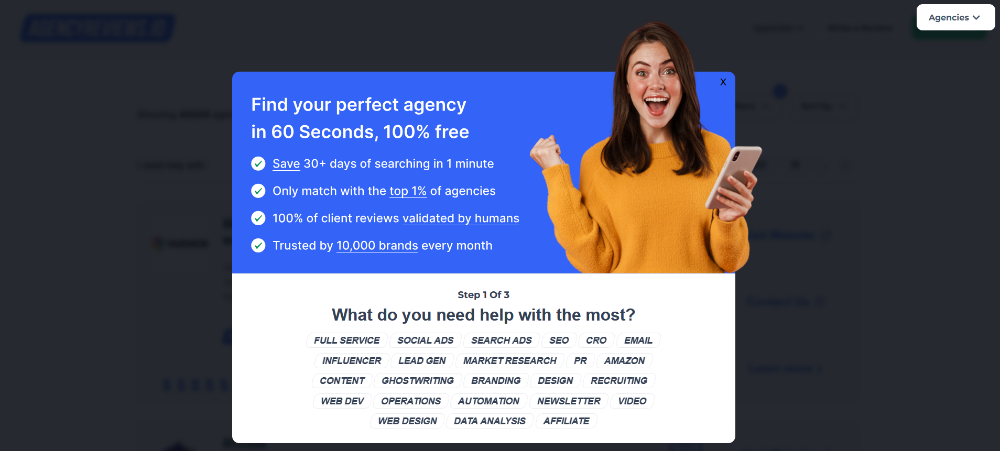
  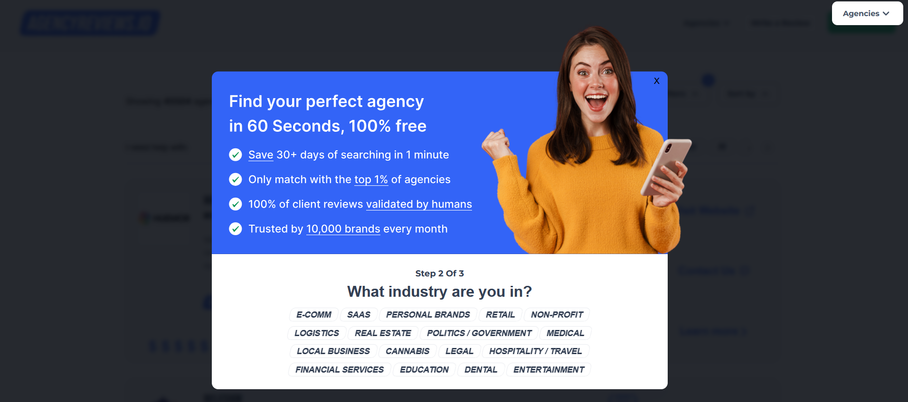
  
  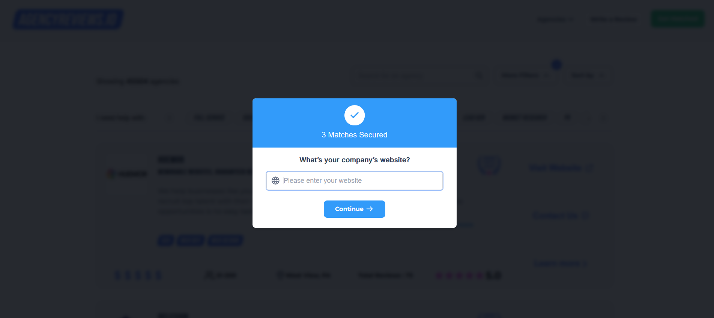
  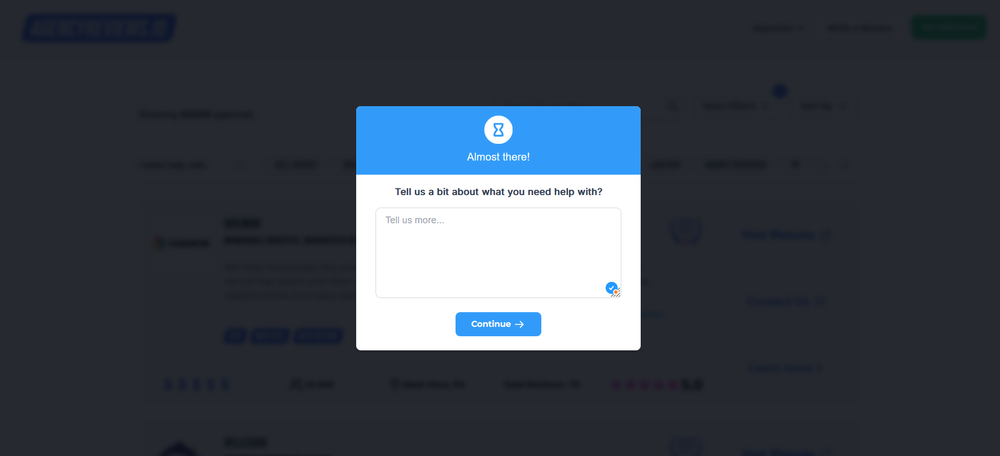
  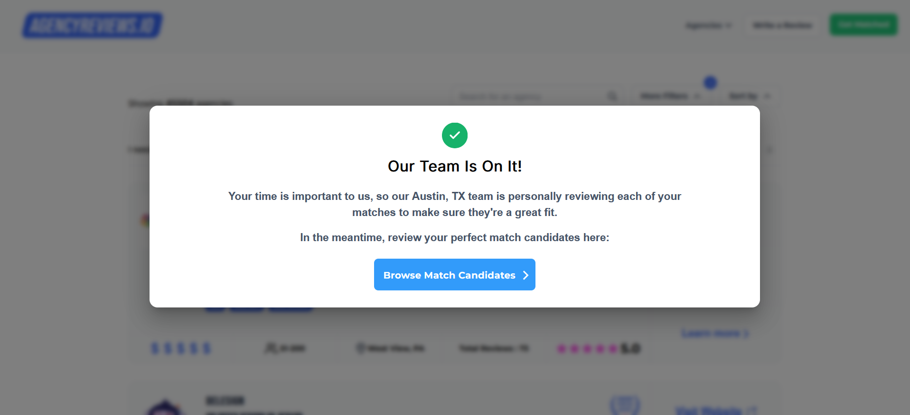
  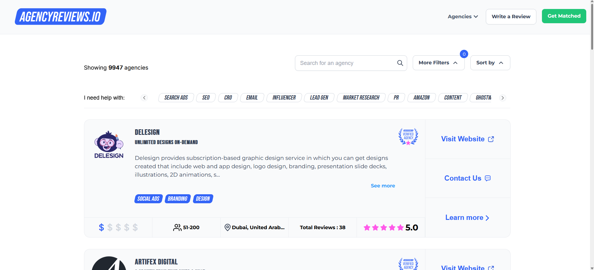
  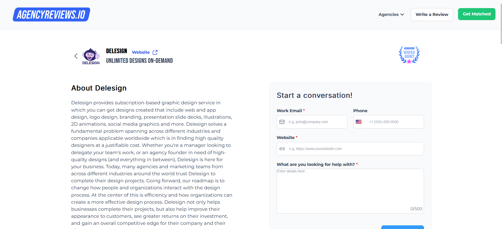
  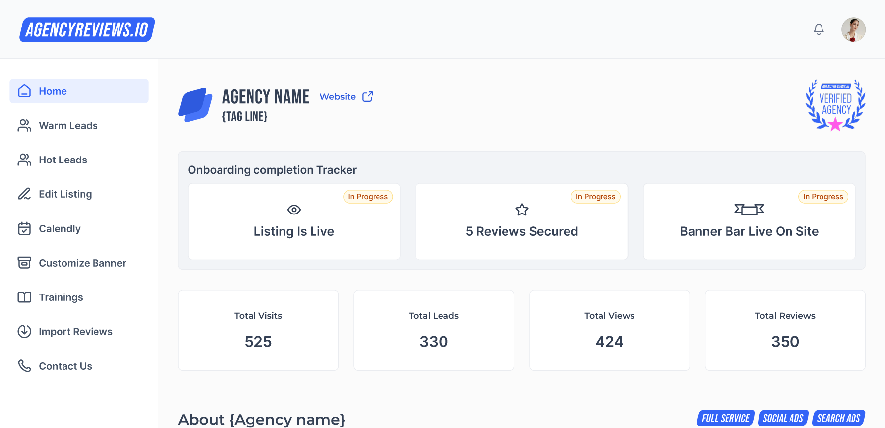
  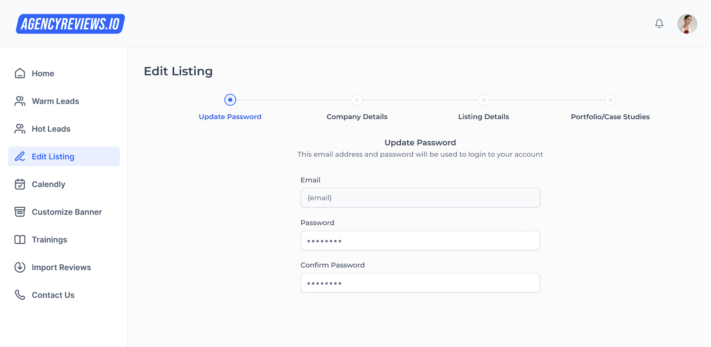
  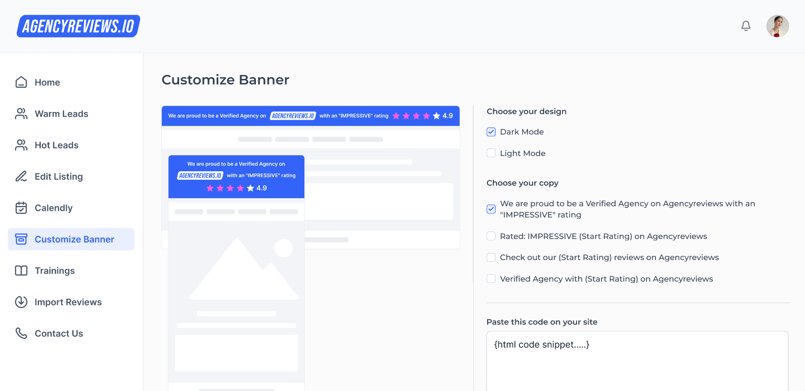
  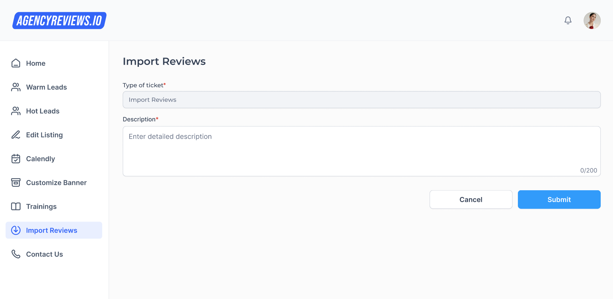
  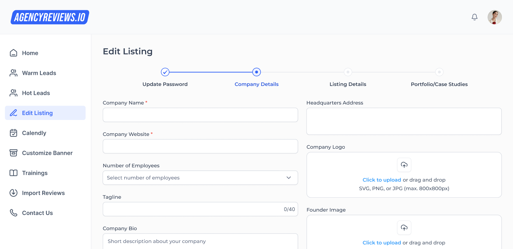
  
  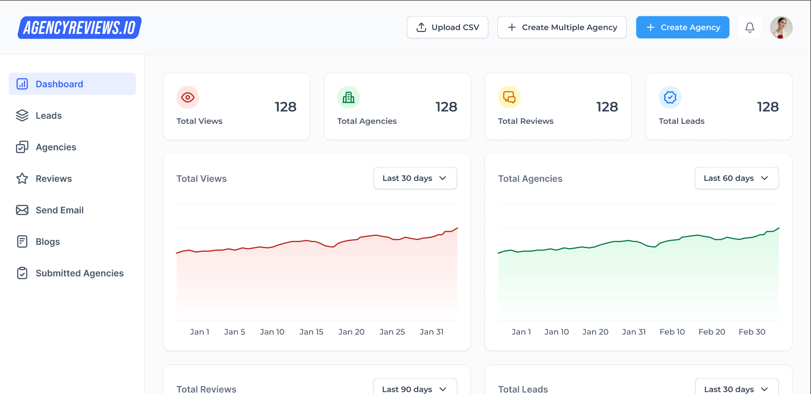
  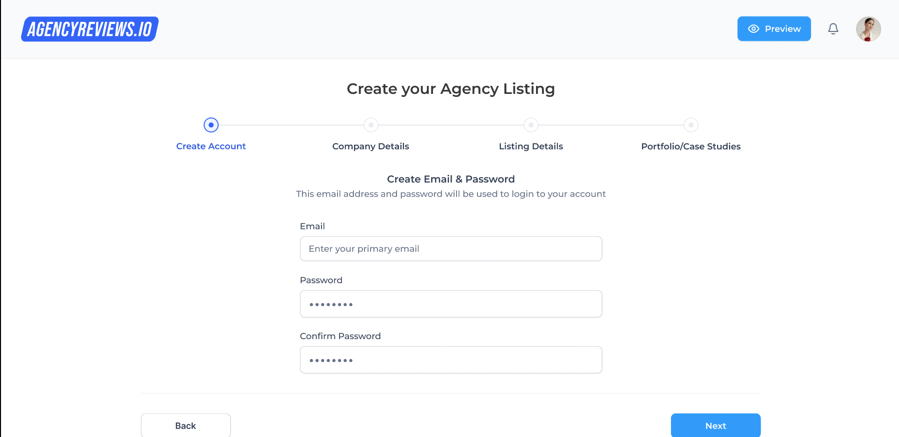
  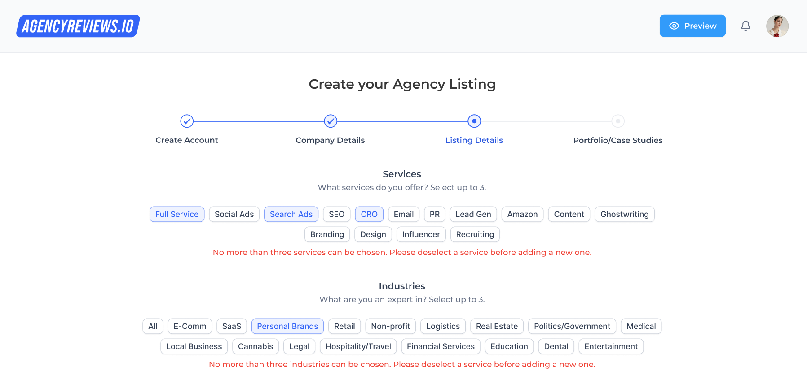
  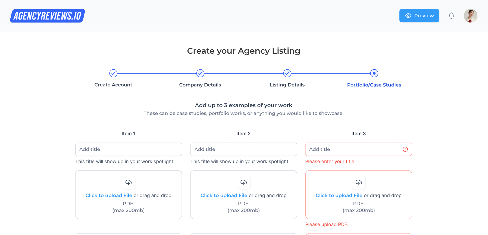
</p>
---

## ⚙️ Getting Started

### 📦 Prerequisites

- Node.js (v16+)
- npm or yarn
- MongoDB / PostgreSQL (your database)

---

### 🔧 Installation

```bash
git clone https://github.com/your-username/agency-reviews-platform.git
cd agency-reviews-platform
npm install
```

---

### 🏁 Running the App

#### 1. Start the backend:

```bash
cd server
npm install
npm run dev
```

#### 2. Start the frontend:

```bash
cd client
npm install
npm start
```

Visit `http://localhost:3000`

---

## 🧠 Skills Demonstrated

- React Component Architecture
- Node.js API and Server-Side Logic
- GraphQL Queries and Mutations
- Responsive UI with Tailwind CSS
- Scalable, Modular Full-Stack Design

---

## 📄 License

[MIT](./LICENSE)


